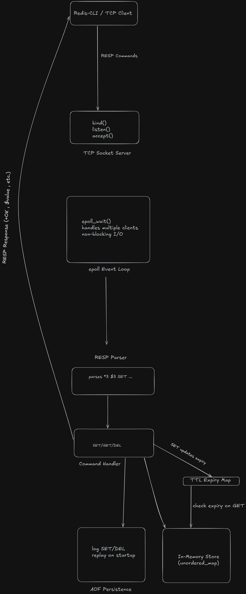
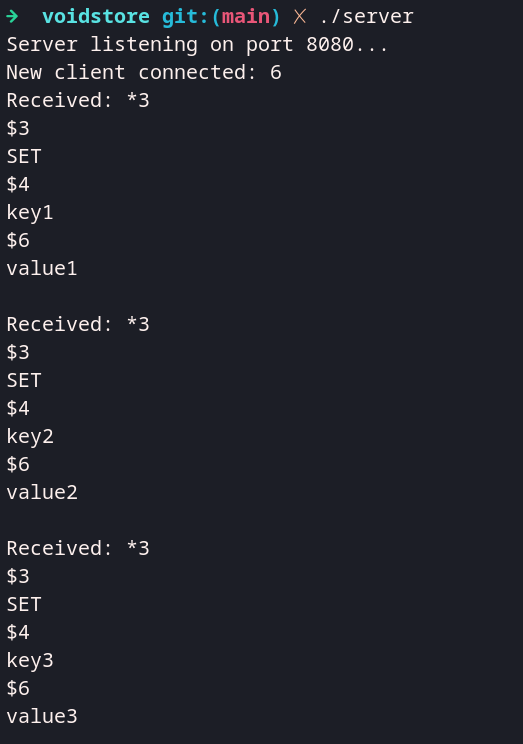

# 🚀 VoidStore — Redis-like In-Memory Database in C++

VoidStore is a high-performance, event-driven in-memory key-value database built from scratch in C++ using Linux `epoll`.
It implements core systems found in real-world data stores, including non-blocking I/O, RESP protocol parsing, TTL expiration, and append-only persistence.

---

## 🎯 Why I built this

To understand how systems like Redis handle networking, concurrency, and data persistence internally—beyond just using them as black boxes.


---

## 🧩 Architecture

---

## ⚙️ How to Run

```bash
g++ src/*.cpp -Iinclude -o server
./server
redis-cli -p 8080
```

---

## ⚡ Benchmark

Handles ~60K requests/sec on local machine (single-threaded, epoll-based event loop).

Measured over multiple runs using redis-cli with piped input (100K SET operations) under minimal system load. Results include client-side overhead.

Observed range: ~60K–63K ops/sec.

Single-threaded design; performance can be further improved using pipelining and multi-threaded request handling.

---

## 🎥 Demo


---

## 🔧 Features

* Event-driven server using `epoll` (non-blocking I/O)
* Redis-compatible RESP protocol parsing
* Multi-client TCP handling using sockets
* In-memory key-value storage with TTL expiration
* Append-Only File (AOF) persistence for durability
* Command support via `redis-cli`

### Supported Commands

```
SET key value
SET key value ttl
GET key
DEL key
```

---

## 🧠 Engineering Highlights

* Designed an **event-driven architecture using epoll** for efficient multi-client handling
* Implemented **lazy TTL expiration** during read operations
* Built a **custom RESP parser** to handle Redis protocol communication
* Implemented **AOF logging and replay** to recover state on restart
* Used **unordered_map for O(1) average-time operations**
* This project focuses on understanding system internals rather than replicating full Redis functionality.

---

## 🧩 Real-World Use Cases

Systems like VoidStore (and Redis) are commonly used for:

* Caching frequently accessed data
* Managing user sessions and authentication
* Real-time features like chat presence
* Background job queues and rate limiting

---

## 🛠 Tech Stack

* C++
* POSIX sockets
* epoll (Linux I/O multiplexing)
* Redis RESP protocol
* STL (unordered_map)

---

## 🚧 Future Improvements

* LIST / SET data structures
* Background TTL cleaner (active expiration)
* RDB snapshot persistence
* Replication support
* Non-blocking socket improvements
